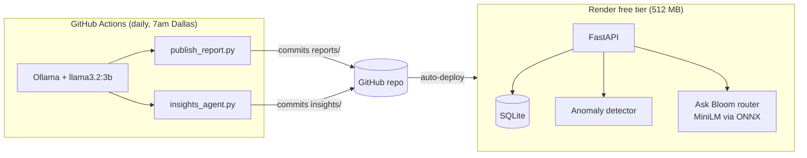

# Bloom Cafe

A coffee shop website with an owner dashboard and AI features that run for **$0**:
anomaly alerts, a daily AI-written report, AI insights, and **Ask Bloom**, a chat
about the cafe's sales.

**Live demo:** https://coffee-bloom.onrender.com
(free tier: the first visit after a quiet period can take ~30–60 seconds to wake up)

The core idea: **code computes every number; AI only writes words.** Every AI feature
was tested, broke in a specific way, and was redesigned around that failure. The
measurements are below.

---

## What it does

| Page | What's there |
|---|---|
| **Home** (`/`) | Welcome, seasonal special, "Most loved this month" (live from sales data), hours |
| **Menu** (`/menu`) | Menu by category, cart, order form (prices always come from the server) |
| **Ask Bloom** (`/chat`) | Ask about sales in plain English; answers use real numbers |
| **Dashboard** (`/dashboard`) | KPIs vs previous period, charts, anomaly alerts, morning report, AI insights |

## Architecture



- **No LLM runs on Render.** A chat model can't fit in 512 MB. The generative AI runs
  daily in GitHub Actions (free for public repos) and commits its output; Render displays it.
- **Ask Bloom** runs on Render with a small **embedding** model (all-MiniLM-L6-v2 via
  fastembed/ONNX). It only decides *which* tool answers the question; code writes the answer.
  Measured worst case with the dashboard: **307 MB**.
- **No API keys, no paid services.** Ollama runs locally or in GitHub Actions.

**Stack:** Python, FastAPI, SQLite, pandas, fastembed (ONNX), Ollama, Chart.js,
GitHub Actions, Render.

---

## The data is simulated, on purpose

Real cafe sales data isn't public, so `simulate.py` generates a year of orders with
realistic patterns: 8am rush, busier weekends, iced drinks in summer, pumpkin spice
from September. It also **plants known events** (a broken cold brew machine, a
festival day, and random events in evaluation runs).

Because I know exactly what's hidden in the data, I can **measure** whether the
anomaly detector finds it. With real data, you never know the right answer.

---

## Anomaly detector

Flags unusual days and multi-day stretches, per item and for total orders.

**How it evolved** (each change fixed a diagnosed failure):

| Version | Method | Result |
|---|---|---|
| v1 | Median + MAD "wobble" score | Caught 1 of 2 planted events, 4 false alarms |
| v2 | **Poisson** model (the right model for counts) | 2 of 2, 2 false alarms (both Saturdays) |
| v3 | Weekday-adjusted baseline, factors learned only from *earlier* data (no leakage) | 2 of 2, 0 false alarms |
| v4 | Also checks **1–7 day windows** (slow dips add up) | Recall 50% → 83% on dev seeds |

**Threshold chosen with a sweep** on development seeds 100–109:

| Threshold | Recall | False alarms / 60 days |
|---|---|---|
| 1e-3 | 87% | 6.9 |
| 1e-4 | 83% | 1.4 |
| **1e-5 (chosen)** | **70%** | **0.0** |
| 1e-6 | 57% | 0.0 |

**Final result on held-out seeds 200–219** (never used during development, run once):

| | Result |
|---|---|
| **Recall** | **83%** (50 of 60 planted events) |
| Item outages | 14/14 |
| Traffic spikes / drops | 8/8, 10/10 |
| Item spikes | 11/15 |
| Item dips | 7/13 |
| **False alarms** | **0.5 per 60 days** |

Dev showed 0.0 false alarms; held-out showed 0.5. That gap is why the final test set exists.
**Known limit:** a 60% dip on an item selling 3–5 a day can't be reliably told apart from
chance within a week.

---

## Morning report

The model writes a one-line headline using `{placeholders}`; code fills in every number
and writes the fact lines underneath. Code checks the model's text, retries with the
reason, and falls back to a template after 3 failures.

| Problem found in testing | Fix |
|---|---|
| Model typed numbers | Placeholders + digit check + retry |
| Misdescribed a 3-way tie as "followed closely by" | Code writes the ranking phrase |
| "72 orders customers" | Units inside values; repeated-word check |
| Copied item names instead of placeholders | Protected-names check |
| The fallback template beat the model | Model narrowed to the headline only |
| "Steady" on any day | Tone must match the numbers |
| "Record-breaking" | Superlatives rejected as unsupported claims |
| A past-day report knew the future | Detector runs "as of" the report day |

Reliability test after the redesign: 10/10 valid headlines, 0 fallbacks.

## AI insights

Code finds situations worth acting on (lost item sales and whether customers switched,
the quietest 2-hour window, when pastries sell, items trending up or down) and computes
every number.

Testing two models on 30 drafts each showed recommendations that **passed every check but
contradicted the data** (e.g. "reduce pastry offerings during morning hours," when 59% of
pastries sell before 11am). So the model now writes **only the title**, and code picks each
recommendation from vetted actions tied to data conditions. Details, bad drafts and
regression tests: [NOTES.md](NOTES.md).

Example: during the cold brew outage, Cold Brew sold about 74 fewer (about $333), but **total sales
were +4.5%, within normal range**. Customers switched to other items, so the insight says
so, instead of claiming the cafe lost money.

---

## Ask Bloom (chat)

1. The question's item names and time phrases are **masked** (delexicalization), so the
   router judges only *what kind* of question it is.
2. MiniLM finds the most similar example question and picks one of five tools:
   sales for an item, top/slowest sellers, busiest times, compare periods, recent alerts.
3. Rules handle clear signals (e.g. "vs" → comparison). Close-but-unsure questions get
   **"Did you mean…?"** with a one-click button.
4. Code runs the tool and writes the answer.

**Routing accuracy:**

| Test | Result |
|---|---|
| Dev set (34 questions, used for tuning) | 97% |
| Held-out v1 (18 questions, run once) | **67%** — tuned to 100% on dev; didn't transfer |
| Held-out v2 (22 fresh questions, after fixing a masking bug + adding "Did you mean") | **86% correct, 95% with one-click recovery** |

Test questions were committed before the router they tested (see git history), but were
not written by an independent tester, and v2 was written after seeing v1's failures.

**Known limits:** it can't tell "talk about drinks" from "ask for sales data" reliably
("what's your favorite drink" → top sellers); no memory between messages; no two-item
comparisons yet.

---

## Automation

`.github/workflows/daily-ai.yml` runs every morning:

- Installs Ollama, pulls `llama3.2:3b` (chosen over 8B: same pass rate, ~2× faster, less than half the download)
- Writes the report and insights, commits only if something changed, Render redeploys
- **Idempotent** (skips if today's report exists), **atomic** file writes,
  **least-privilege** token (`contents: write`), no overlapping runs
- A full run took **1 min 29 s**

---

## Run it locally

```bash
git clone https://github.com/Yasminenaser1/bloom-cafe.git
cd bloom-cafe
python3 -m venv .venv && source .venv/bin/activate
pip install -r requirements.txt
python -m uvicorn api:app --reload        # http://127.0.0.1:8000
```

Optional (AI writing needs [Ollama](https://ollama.com) with `llama3.2:3b`):

```bash
python publish_report.py          # morning report
python insights_agent.py          # AI insights
python evaluate.py                # anomaly detector eval
python evaluate_chat.py           # chat routing eval (dev set)
python -m unittest discover -s tests -v   # tests
```

## Honest limitations

- Order history is **simulated**; real orders placed on the live site reset on each
  redeploy (Render's free tier has no persistent disk). Production would use Postgres.
- AI output is generated **daily**, not on demand.
- Evaluation sets were written by the developer, not independent testers.

## Project layout

```
api.py              FastAPI app and routes
db.py               SQLite schema + menu
simulate.py         demo order history with planted events
insights.py         KPIs, charts data
anomalies.py        Poisson anomaly detector
evaluate.py         detector evaluation (dev seeds, held-out seeds, threshold sweep)
report.py           morning report (model headline + code facts + checks)
publish_report.py   daily report job
findings.py         code-only insight finders
insights_agent.py   AI insight titles + vetted recommendations
chat_tools.py       Ask Bloom tools
chat.py             Ask Bloom router
evaluate_chat.py    chat routing evaluation
mem_check.py        memory check for Render's 512 MB limit
static/             pages, styles, logo
reports/ insights/  published daily by GitHub Actions
```
